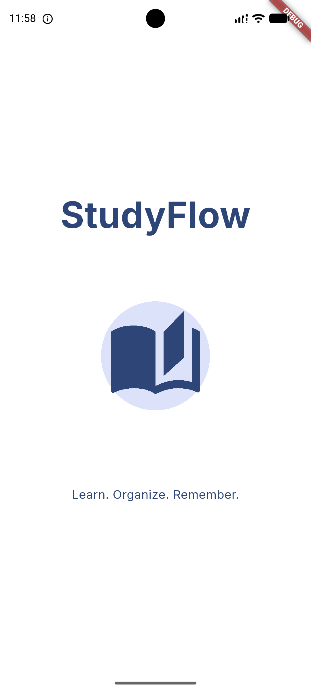
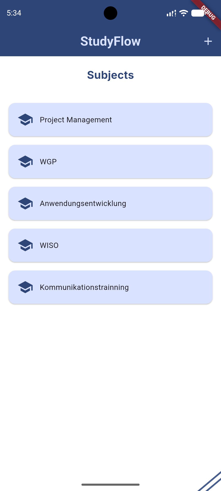
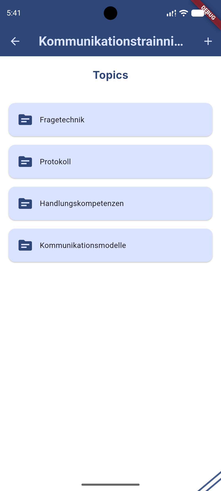
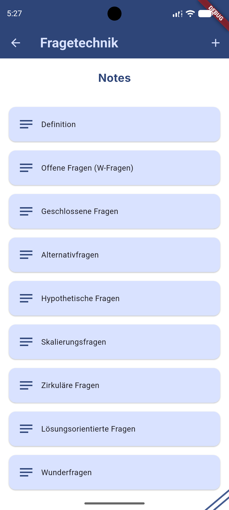
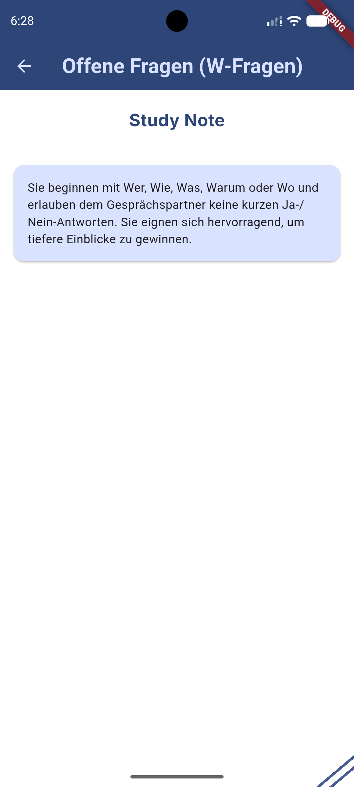
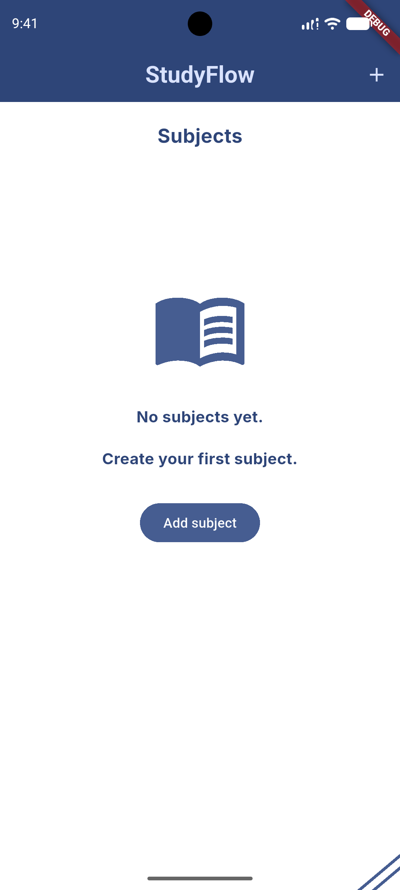
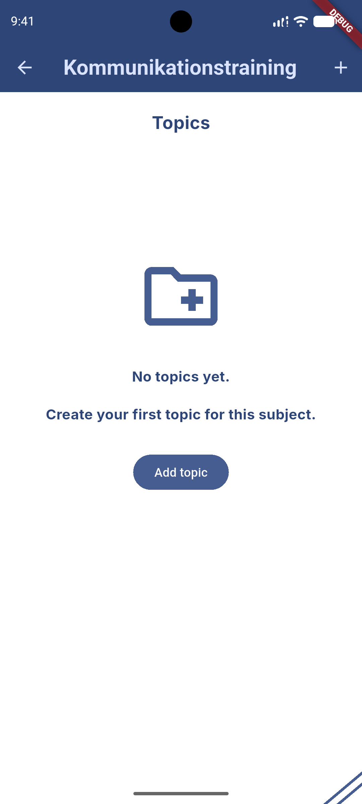
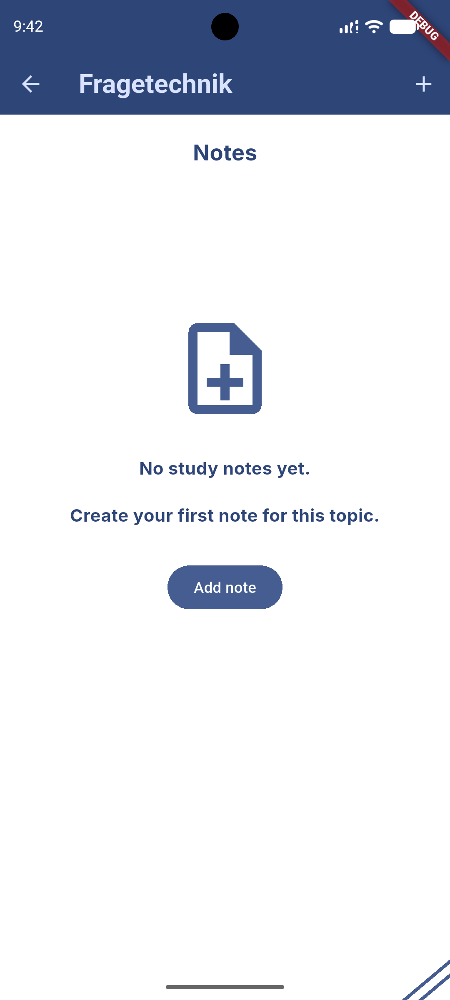

# StudyFlow Frontend

This folder contains the Flutter frontend for StudyFlow.

The current frontend is a local-first prototype. It uses local in-memory repositories backed by example data and is not connected to the ASP.NET Core backend yet.

## Current Features

- Start screen before entering the main StudyFlow flow
- View subjects
- Create subjects locally
- View topics for a selected subject
- Create topics locally
- View study notes for a selected topic
- Create study notes locally
- Delete study notes locally
- Open a study note and read its content
- Basic Material Design UI
- Custom color scheme
- Local repository layer for subjects, topics, and study notes
- Repository contracts for local-first data access
- String-based IDs prepared for ToStore and backend integration
- Dependency registration with get_it
- Reusable layout, list item, and empty state widgets
- SnackBar feedback for local actions
  
## Screenshots

Current work-in-progress Flutter UI using local in-memory repositories backed by example data.

<p>
  
  
  
  
  
</p>

## Empty States

Screens shown when there is no local data yet.

<p>
  
  
  
</p>

## App Flow

```text
StartScreen
-> SubjectsScreen
-> TopicsScreen
-> StudyNotesScreen
-> NoteScreen
```

## Project Structure

```text
lib/
|-- core/
|   `-- service_locator.dart
|-- data/
|   `-- example_data.dart
|-- local/
|   |-- local_subjects_repository.dart
|   |-- local_topics_repository.dart
|   `-- local_study_notes_repository.dart
|-- models/
|   |-- subject.dart
|   |-- topic.dart
|   `-- study_note.dart
|-- repositories/
|   `-- contracts/
|       |-- subjects_repository.dart
|       |-- topics_repository.dart
|       `-- study_notes_repository.dart
|-- screens/
|   |-- start_screen.dart
|   |-- subject_screen.dart
|   |-- topics_screen.dart
|   |-- study_notes_screen.dart
|   |-- note_screen.dart
|   |-- new_subject.dart
|   |-- new_topic.dart
|   `-- new_study_note.dart
`-- widgets/
    |-- corner_lines.dart
    |-- empty_state_message.dart
    |-- studyflow_screen_body.dart
    `-- study_notes/
        `-- study_note_list_item.dart
```

## Tech Stack

- Dart
- Flutter
- Material Design
- Local in-memory repositories
- Repository pattern with local implementations
- get_it for dependency registration
- ToStore dependency added for upcoming local persistence
- StatefulWidget and setState for local state
- Flutter Navigator for screen navigation

## Run Locally

Install dependencies:

```powershell
flutter pub get
```

Analyze the project:

```powershell
flutter analyze
```

Run the app:

```powershell
flutter run
```

## Current Status

The frontend is intentionally local-first at this stage. Screens access data through repository contracts. The current repository implementations are in-memory and backed by local example data. Models now use string-based IDs to prepare the app for ToStore persistence and later backend synchronization.

The goal of this sprint is to understand Flutter fundamentals, screen navigation, local state, forms, list rendering, dependency registration, repository-based data access, and basic UI structure before connecting the app to persistence or the backend.

## Next Steps

- Refine repository structure
- Add local persistence with ToStore, starting with subjects
- Improve form validation
- Add quizzes and questions
- Prepare API service classes
- Connect the Flutter frontend to the ASP.NET Core backend

