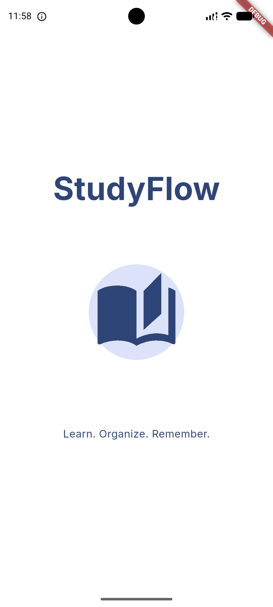
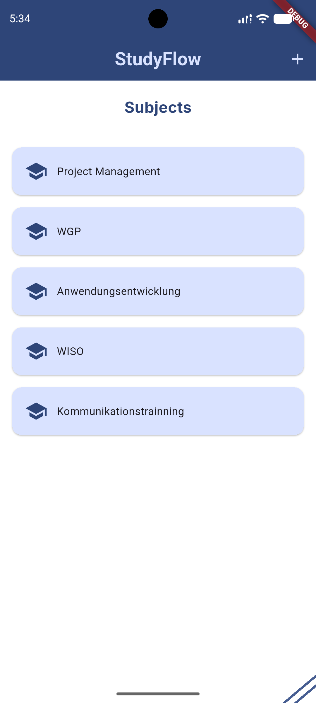
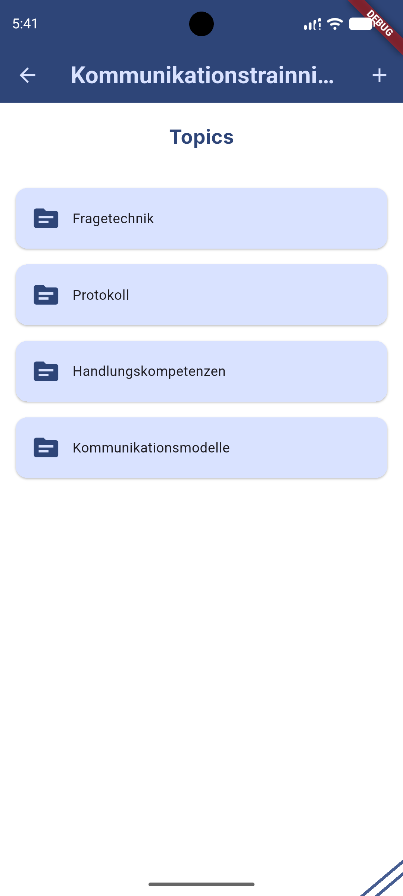
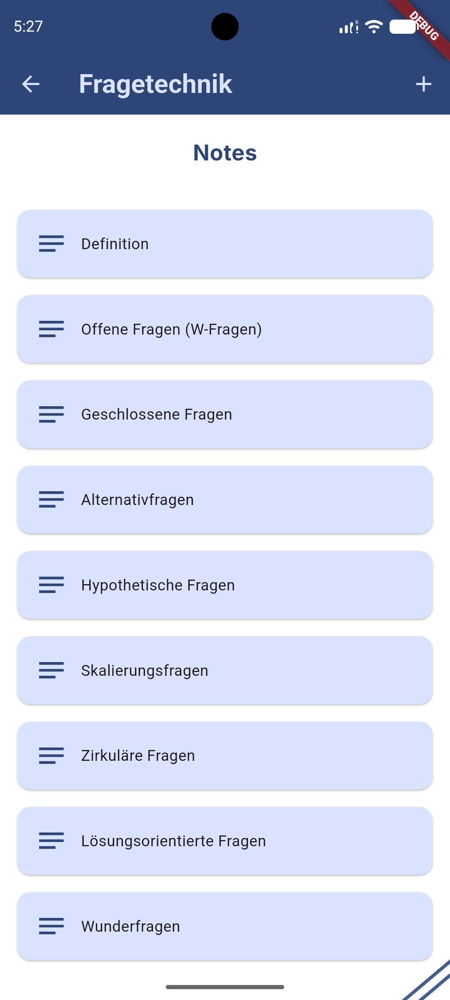
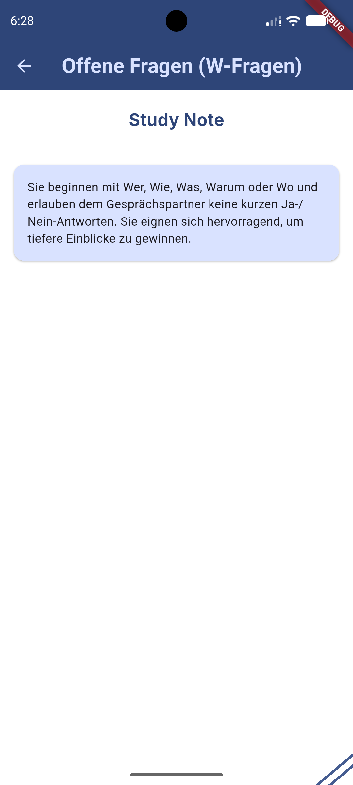
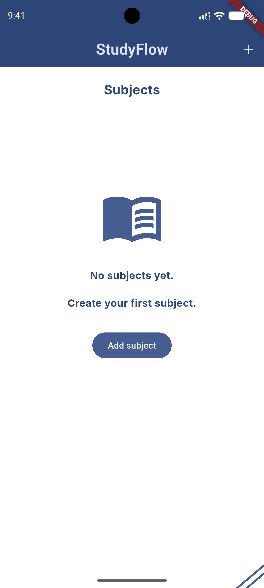
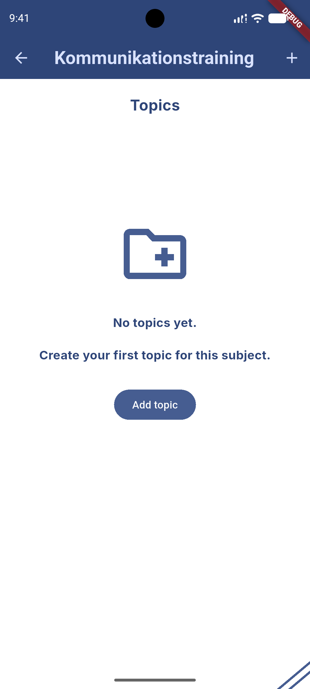
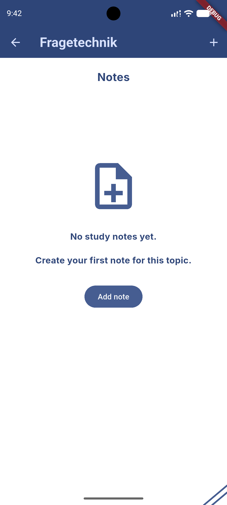

# StudyFlow Frontend

This folder contains the Flutter frontend for StudyFlow.

The current frontend is a local-first prototype. It uses repository contracts with ToStore-backed local persistence and is not connected to the ASP.NET Core backend yet.

The app has been migrated from screen-owned list state and direct screen-level dependency access to Riverpod providers and controllers for the main local-first study and quiz flows. Riverpod now handles the async access patterns for subjects, topics, study notes, quizzes, questions, answer options, quiz validation, quiz play data loading, and JSON seed import. Subjects, topics, study notes, quizzes, quiz questions, and answer options already use stream-based providers for automatic local UI updates.

## Current Features

- Start screen before entering the main StudyFlow flow
- View, create, edit, and delete subjects locally
- View, create, edit, and delete topics locally
- Open topics in a dedicated topic detail screen
- Switch between notes and quiz area with a bottom navigation bar
- View, create, edit, and delete study notes locally
- Open a study note and read its content
- Create quizzes locally
- View, create, edit, and delete quiz questions locally
- View, create, edit, and delete answer options locally
- Mark answer options as correct
- Validate quiz readiness before starting
- Start a quiz and answer questions
- Randomize quiz questions and answer options during quiz play
- Show visual feedback for correct and incorrect quiz answers
- View final quiz results with score, percentage, and retry option
- Import structured study content from pasted JSON seed data
- Reuse existing subjects and topics during JSON seed import to avoid duplicates
- ToStore-backed local persistence for subjects, topics, study notes, quizzes, questions, and answer options
- Cascade deletion support through ToStore relationships
- Repository contracts for local-first data access
- Riverpod migration for the main local-first study and quiz flows
- Stream-based Riverpod providers for automatic UI updates in migrated local lists
- Riverpod controllers for create/edit/delete actions
- Application-level helpers for quiz validation, quiz play data loading, and JSON seed import
- String-based IDs prepared for ToStore and backend integration
- Basic Material Design UI
- Custom color scheme
- Reusable list item and empty state widgets
- SnackBar feedback for local actions

## Screenshots

Current work-in-progress Flutter UI using local-first ToStore persistence.

<p>
  
  
  
  
  
</p>

## Empty States

Screens shown when there is no local data yet.

<p>
  
  
  
</p>

## App Flow

```text
StartScreen
-> SubjectsScreen
-> TopicsScreen
-> TopicDetailScreen
   -> StudyNotesScreen
      -> NoteScreen
   -> QuizzesScreen
      -> QuizQuestionsScreen
         -> QuestionDetailScreen
      -> QuizPlayScreen
         -> QuizResultScreen
```

## Project Structure

```text
frontend/
|-- docs/
|   |-- architecture/
|   `-- screenshots/
|-- lib/
|   |-- application/
|   |   |-- import/
|   |   |   |-- import_study_seed.dart
|   |   |   |-- study_seed.dart
|   |   |   |-- study_seed_parser.dart
|   |   |   `-- study_seed_validation.dart
|   |   `-- quiz/
|   |       |-- load_quiz_play_data.dart
|   |       |-- quiz_play_data.dart
|   |       `-- validate_quiz_can_start.dart
|   |-- controllers/
|   |   |-- subjects_controller.dart
|   |   |-- topics_controller.dart
|   |   |-- study_notes_controller.dart
|   |   |-- quizzes_controller.dart
|   |   |-- questions_controller.dart
|   |   `-- answer_options_controller.dart
|   |-- local/
|   |   `-- tostore/
|   |       |-- studyflow_database.dart
|   |       |-- studyflow_schemas.dart
|   |       |-- tostore_subjects_repository.dart
|   |       |-- tostore_topics_repository.dart
|   |       |-- tostore_study_notes_repository.dart
|   |       |-- tostore_quizzes_repository.dart
|   |       |-- tostore_questions_repository.dart
|   |       `-- tostore_answer_options_repository.dart
|   |-- models/
|   |   |-- subject.dart
|   |   |-- topic.dart
|   |   |-- study_note.dart
|   |   |-- quiz.dart
|   |   |-- question.dart
|   |   `-- answer_option.dart
|   |-- providers/
|   |   |-- answer_options_repository_provider.dart
|   |   |-- answer_options_stream_provider.dart
|   |   |-- import_study_seed_provider.dart
|   |   |-- load_quiz_play_data_provider.dart
|   |   |-- questions_repository_provider.dart
|   |   |-- questions_stream_provider.dart
|   |   |-- quizzes_repository_provider.dart
|   |   |-- quizzes_stream_provider.dart
|   |   |-- study_notes_repository_provider.dart
|   |   |-- study_notes_stream_provider.dart
|   |   |-- subjects_repository_provider.dart
|   |   |-- subjects_stream_provider.dart
|   |   |-- topics_repository_provider.dart
|   |   |-- topics_stream_provider.dart
|   |   `-- validate_quiz_can_start_provider.dart
|   |-- repositories/
|   |   `-- contracts/
|   |-- screens/
|   `-- widgets/
|-- pubspec.yaml
`-- README.md
```

## Tech Stack

- Dart
- Flutter
- Material Design
- ToStore for local persistence
- Repository pattern with local ToStore implementations
- Riverpod for state management, dependency access, and controller-based screen logic
- StreamProvider for automatic UI updates in migrated local lists
- StatefulWidget and setState for purely local visual UI state
- Flutter Navigator for screen navigation

## Run Locally

Install dependencies:

```powershell
flutter pub get
```

Analyze the project:

```powershell
flutter analyze
```

Run the app:

```powershell
flutter run
```

# Current Status

The frontend is intentionally local-first at this stage.

Screens access data through repository contracts, and the active implementations use ToStore for local persistence. Subjects, topics, study notes, quizzes, questions, and answer options are stored locally.

Subjects, topics, study notes, quizzes, questions, answer options, quiz validation, and quiz play data loading have been migrated to Riverpod-based providers, controllers, and application-level helpers. Subjects, topics, study notes, quizzes, quiz questions, and answer options now use stream-based providers backed by ToStore watchers, so their lists update automatically when local data changes. Controllers delegate persistence operations to the ToStore-backed repositories, while screens observe provider state and forward user actions to controllers instead of loading and storing entity lists manually.

The app now supports local create, edit, and delete flows for the main study entities: subjects, topics, study notes, quiz questions, and answer options. Larger deletion flows, such as subjects and topics, use confirmation dialogs because related data can be removed through ToStore cascade relationships.

The quiz area has a first usable local flow. Users can create quiz questions, add answer options, mark correct answers, prevent multiple correct answers for the same question, edit quiz content, validate quiz readiness before starting, play quizzes with randomized questions and answer options, receive visual feedback for correct and incorrect answers, and view a final result screen with score and percentage.

The frontend now includes an initial JSON seed import flow. Users can paste structured JSON into a temporary import screen and create subjects, topics, study notes, quizzes, questions, and answer options locally. Existing subjects and topics are reused by normalized name comparison, so imports can add content to existing study areas without duplicating the main structure.

The frontend models use string-based IDs to prepare the app for local persistence and later backend synchronization.

The next major step is improving the JSON import UX, moving import access into a better navigation surface, and preparing import/export features for local study content.

## Next Steps

- Preserve list position when items are edited
- Improve form validation
- Add an initial seed with public demo learning content
- Improve JSON import with file picker support
- Add JSON export for study content
- Prepare API service classes
- Connect the Flutter frontend to the ASP.NET Core backend
- Add synchronization between local data and backend data
- Refactor StudyNotesScreen into an internal StudyNotesView
