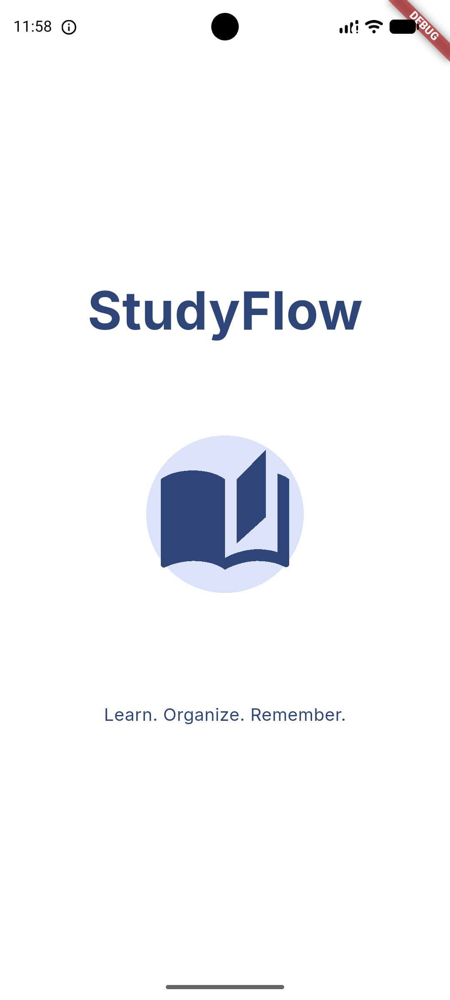
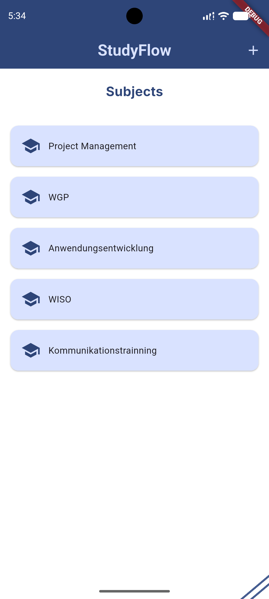
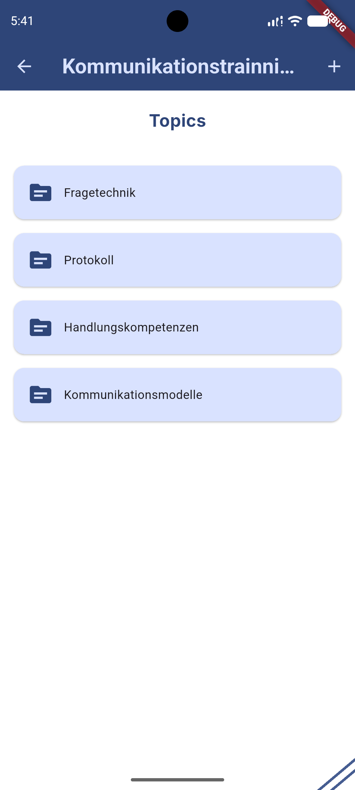
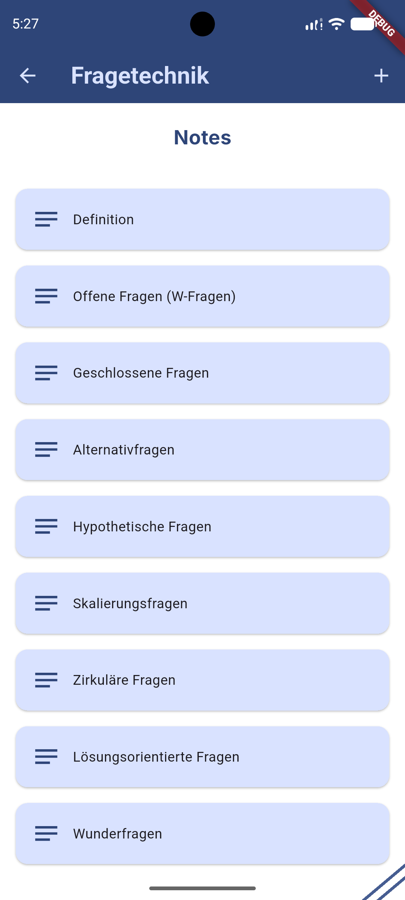
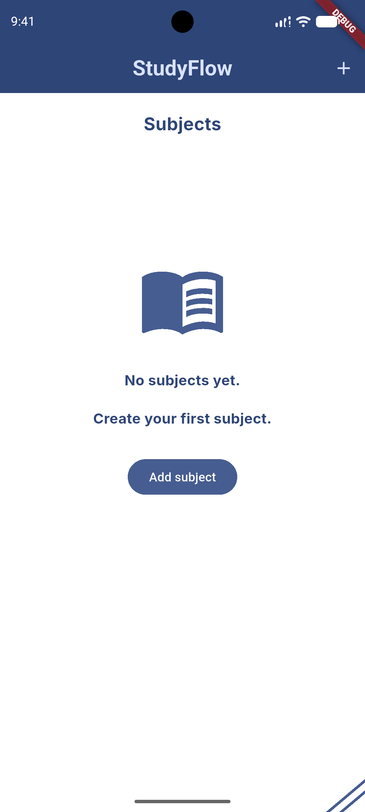
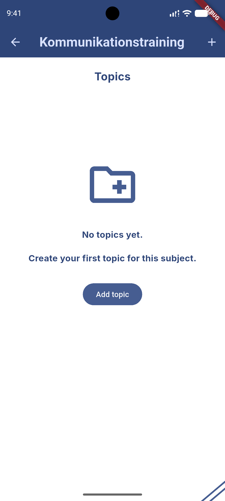
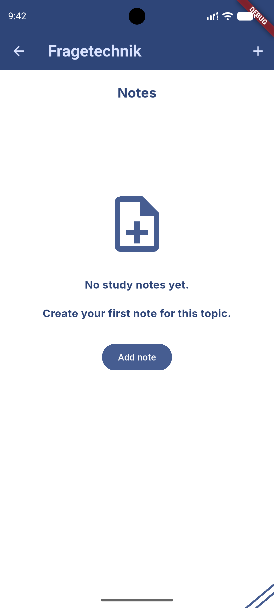

# StudyFlow Frontend

This folder contains the Flutter frontend for StudyFlow.

The current frontend is a local-first prototype. It uses repository contracts with ToStore-backed local persistence and is not connected to the ASP.NET Core backend yet.

The app uses Riverpod providers and controllers for its local-first study, quiz, and exam preparation flows. Riverpod handles asynchronous access to local entities, quiz validation, quiz play data loading, and JSON seed import. The UI includes Study Mode, the first functional Exam Mode screens, Markdown rendering, responsive layouts, and light/dark theme support.

## Current Features

- Start screen before entering the main StudyFlow flow
- Mode selection screen with functional Study Mode and Exam Mode entry points
- View, create, edit, and delete subjects locally
- View, create, edit, and delete topics locally
- Open topics in a dedicated topic detail screen
- Switch between notes and quiz area with a bottom navigation bar
- View, create, edit, and delete study notes locally
- Open a study note and read Markdown-rendered content
- Create quizzes locally
- View, create, edit, and delete quiz questions locally
- View, create, edit, and delete answer options locally
- Mark answer options as correct
- Validate quiz readiness before starting
- Start a quiz and answer questions
- Randomize quiz questions and answer options during quiz play
- Render quiz questions and answer options as Markdown
- Show visual feedback for correct and incorrect quiz answers
- View final quiz results with score, percentage, and retry option
- Create, edit, and delete exam sections such as AP1 or AP2
- Open an exam section with Tips, Exams, and History tabs
- Create, edit, delete, and read Markdown-formatted exam tips locally
- Import structured content from pasted JSON or a selected `.json` file
- Import subjects, topics, notes, quizzes, exam sections, and exam tips
- Reuse existing subjects, topics, and exam sections during JSON seed import
- ToStore-backed local persistence for Study Mode and the current Exam Mode entities
- Cascade deletion support through ToStore relationships
- Repository contracts for local-first data access
- Riverpod migration for the main local-first study and quiz flows
- Stream-based Riverpod providers for automatic UI updates in migrated local lists
- Riverpod controllers for create/edit/delete actions
- Application-level helpers for quiz validation, quiz play data loading, and JSON seed import
- String-based IDs prepared for ToStore and backend integration
- Basic Material Design UI
- Custom light and dark color schemes
- Reusable mode card, list item, form button, SnackBar, and empty state widgets
- Themed SnackBar feedback for local success, info, error, and delete actions

## Screenshots

Current work-in-progress Flutter UI using local-first ToStore persistence.

<p>
  
  
  
  
  
</p>

## Empty States

Screens shown when there is no local data yet.

<p>
  
  
  
</p>

## App Flow

```text
StartScreen
-> ModeSelectionScreen
   -> Study Mode
      -> SubjectsScreen
         -> TopicsScreen
            -> TopicDetailScreen
               -> StudyNotesScreen
                  -> NoteScreen
               -> QuizzesScreen
                  -> QuizQuestionsScreen
                     -> QuestionDetailScreen
                  -> QuizPlayScreen
                     -> QuizResultScreen
   -> Exam Mode
      -> ExamSectionsScreen
         -> ExamSectionDetailScreen
            -> ExamTipsScreen
               -> ExamTipScreen
            -> Practice Exams (planned)
            -> History (planned)
```

## Project Structure

```text
frontend/
|-- docs/
|   |-- architecture/
|   `-- screenshots/
|-- lib/
|   |-- application/
|   |   |-- import/
|   |   |   |-- import_study_seed.dart
|   |   |   |-- study_seed.dart
|   |   |   |-- study_seed_parser.dart
|   |   |   `-- study_seed_validation.dart
|   |   `-- quiz/
|   |       |-- load_quiz_play_data.dart
|   |       |-- quiz_play_data.dart
|   |       `-- validate_quiz_can_start.dart
|   |-- controllers/
|   |   |-- exam_sections_controller.dart
|   |   |-- exam_tips_controller.dart
|   |   |-- subjects_controller.dart
|   |   |-- topics_controller.dart
|   |   |-- study_notes_controller.dart
|   |   |-- quizzes_controller.dart
|   |   |-- questions_controller.dart
|   |   `-- answer_options_controller.dart
|   |-- local/
|   |   `-- tostore/
|   |       |-- studyflow_database.dart
|   |       |-- studyflow_schemas.dart
|   |       |-- tostore_exam_sections_repository.dart
|   |       |-- tostore_exam_tips_repository.dart
|   |       |-- tostore_subjects_repository.dart
|   |       |-- tostore_topics_repository.dart
|   |       |-- tostore_study_notes_repository.dart
|   |       |-- tostore_quizzes_repository.dart
|   |       |-- tostore_questions_repository.dart
|   |       `-- tostore_answer_options_repository.dart
|   |-- models/
|   |   |-- exam_section.dart
|   |   |-- exam_tip.dart
|   |   |-- subject.dart
|   |   |-- topic.dart
|   |   |-- study_note.dart
|   |   |-- quiz.dart
|   |   |-- question.dart
|   |   `-- answer_option.dart
|   |-- providers/
|   |   |-- answer_options_repository_provider.dart
|   |   |-- answer_options_stream_provider.dart
|   |   |-- exam_sections_repository_provider.dart
|   |   |-- exam_sections_stream_provider.dart
|   |   |-- exam_tips_repository_provider.dart
|   |   |-- exam_tips_stream_provider.dart
|   |   |-- import_study_seed_provider.dart
|   |   |-- load_quiz_play_data_provider.dart
|   |   |-- questions_repository_provider.dart
|   |   |-- questions_stream_provider.dart
|   |   |-- quizzes_repository_provider.dart
|   |   |-- quizzes_stream_provider.dart
|   |   |-- study_notes_repository_provider.dart
|   |   |-- study_notes_stream_provider.dart
|   |   |-- subjects_repository_provider.dart
|   |   |-- subjects_stream_provider.dart
|   |   |-- topics_repository_provider.dart
|   |   |-- topics_stream_provider.dart
|   |   `-- validate_quiz_can_start_provider.dart
|   |-- repositories/
|   |   `-- contracts/
|   |-- screens/
|   |-- theme/
|   `-- widgets/
|-- pubspec.yaml
`-- README.md
```

## Tech Stack

- Dart
- Flutter
- Material Design
- ToStore for local persistence
- Repository pattern with local ToStore implementations
- Riverpod for state management, dependency access, and controller-based screen logic
- StreamProvider for automatic UI updates in migrated local lists
- flutter_markdown for rendering study notes, quiz questions, and answer options
- file_selector for importing JSON files through the platform file picker
- StatefulWidget and setState for purely local visual UI state
- Flutter Navigator for screen navigation

## Run Locally

Install dependencies:

```powershell
flutter pub get
```

Analyze the project:

```powershell
flutter analyze
```

Run the app:

```powershell
flutter run
```

## JSON Seed Import

StudyFlow accepts pasted JSON and `.json` files. A seed can contain Study Mode
content, Exam Mode sections, or both. Existing subjects, topics, and exam
sections are reused when their normalized names match.

- [JSON seed format](docs/json-seed-template.md)
- [Exam Mode seed example](docs/exam-seed-example.json)

Study notes, quizzes, questions, answer options, and exam tips are added as new
content when a seed is imported again. Import rollback and Practice Exam import
are not implemented yet.

# Current Status

The frontend is intentionally local-first at this stage.

Screens access data through repository contracts, and the active implementations use ToStore for local persistence. Subjects, topics, study notes, quizzes, questions, and answer options are stored locally.

Subjects, topics, study notes, quizzes, questions, answer options, quiz validation, and quiz play data loading have been migrated to Riverpod-based providers, controllers, and application-level helpers. Subjects, topics, study notes, quizzes, quiz questions, and answer options now use stream-based providers backed by ToStore watchers, so their lists update automatically when local data changes. Controllers delegate persistence operations to the ToStore-backed repositories, while screens observe provider state and forward user actions to controllers instead of loading and storing entity lists manually.

The app now supports local create, edit, and delete flows for the main study entities: subjects, topics, study notes, quiz questions, and answer options. Larger deletion flows, such as subjects and topics, use confirmation dialogs because related data can be removed through ToStore cascade relationships.

The quiz area has a first usable local flow. Users can create quiz questions, add answer options, mark correct answers, prevent multiple correct answers for the same question, edit quiz content, validate quiz readiness before starting, play quizzes with randomized questions and answer options, receive visual feedback for correct and incorrect answers, and view a final result screen with score and percentage.

Study notes, quiz questions, and answer options are rendered as Markdown when shown to the user. This keeps generated JSON seed content readable when it includes bullets, emphasis, short explanations, or simple structured text.

The UI has a dedicated mode selection screen after the start screen. Study Mode opens the subject/topic/note/quiz flow. Exam Mode opens locally persisted exam sections and provides a section detail screen with Tips, Exams, and History destinations. Tips are functional and support Markdown; Practice Exams and History are placeholders for the next development stage. JSON seed import is available from the mode selection area.

Light and dark themes are configured in `lib/theme/app_theme.dart`. Shared UI helpers keep repeated styling consistent, including mode cards, primary form button styling, and success/info/error/delete SnackBars.

The JSON seed import flow accepts pasted JSON and `.json` files through the platform file selector. It can create Study Mode content as well as exam sections and exam tips. Existing subjects, topics, and exam sections are reused by normalized name comparison. The importer validates the seed and retries local creation operations to tolerate temporary ToStore ID-pool delays.

The frontend models use string-based IDs to prepare the app for local persistence and later backend synchronization.

The next major work is completing Exam Mode with Practice Exams, answer explanations, persisted attempts, and a useful history view.

## Next Steps

- Review and reorganize the growing codebase by feature
- Centralize navigation before adding more Exam Mode screens
- Add Practice Exam models, persistence, management, and simulation
- Add a Markdown explanation to every Practice Exam answer
- Persist exam attempts and show basic result history
- Extend JSON seeds with Practice Exams and answer explanations
- Add mixed Study Mode tests across all topics in a subject
- Add an application icon and complete release testing
- Add JSON export, backend integration, and synchronization after V1
